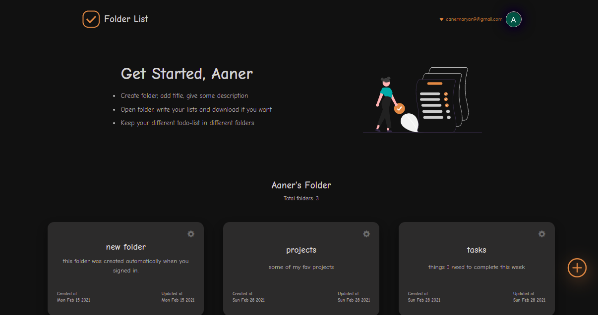
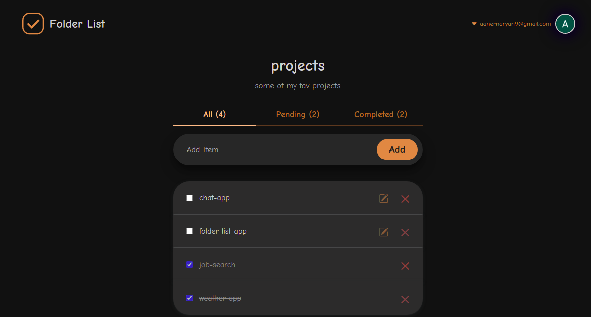

<!-- intro -->
<h1>Folder List App</h1>
<p>It is a full-stack app almost like a todo list app but with extended features. We can use to keep our todo list separately inside different folders like keeping our files in different directories. Fully responsive, mobile first aproach. Build with MERN stack. Hosted with <a href="https://www.heroku.com/" target="_blank">Heroku</a>. </p>

<br>

<!-- badges -->
<div align="center">
  
</div>

<br>

<!-- screen shot -->
<div align="center">
  
</div>

<br>

<div align="center">
  
</div>

<br>

<h2>Get started</h2>

<br>

## Build with

These were the main technologies used in this project.

- [Mongodb](https://www.mongodb.com/) - Nosql document based database
- [ExpressJS](https://expressjs.com/) - NodeJS framework for web and mobile applications
- [React](https://reactjs.org/) - JavaScript library for building user interfaces
- [Redux](https://redux.js.org/) - A Predictable State Container for JS Apps
- [NodeJS](https://nodejs.org/en/) - JavaScript runtime engine built on Chrome's V8 JavaScript engine a that runs javascript outside the web browser

<br>

some other technologies are,

- [PassportJS](http://www.passportjs.org/) - Passport is authentication middleware for Node.js
- [react-bootstrap](https://react-bootstrap.github.io/) - The most popular front-end framework for UI components
- [Bootstrap](https://getbootstrap.com/) - The most popular front-end framework

<br>

<h2>Local setup</h2>
<p>Client is inside the server root directory therefore two server will be running at the same time at same root level directory. I have used concurrently so both the servers will start with one script.</p>
<div>
  
</div>

<br>

<h3>Prerequisites</h3>

<p>Install <a href="https://nodejs.org/en/" target="_blank">node</a>, npm and <a href="https://git-scm.com/downloads" target="_blank">git</a> .</p>

<br>

<h2>Server setup</h2>

```
git clone https://github.com/ramankarki/folder-list-app.git

cd folder-list-app

npm install nodemon -g

npm install
```

<br>

Create a config.env file in root and add some env variables.

```
NODE_ENV=development

COOKIE_KEY=random string whatever you want
DBSTRING=your mongodb database string

// I have used google oauth2.0 for authentication and passport-js for handeling oauth flow

GOOGLE_CLIENT_ID=google concent screen client id
GOOGLE_SECRET_ID=google concent screen secret key
```

<br>

Create a config folder in root and dev.js file inside config folder.

```
module.exports = {
  dbstring:
    "your mongodb database string",
  cookieKey: "random string whatever you want",
  googleClientID:
    "google concent screen client id",
  googleSecretID: "google concent screen secret key",
};
```
